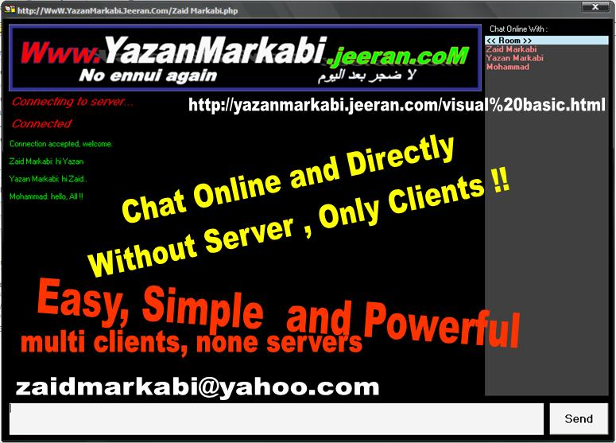



## Chat online Without Servers and multi clients

### Description

Chat online Without Servers and multi clients

Easy, Simple and powerful program .. without any Dll or OCX files .. see screenshot and get it now ..
 
### More Info
 

             |
---                |---
**Submitted On**   |2008-10-24 08:00:02
**By**             |[Zaid Markabi](https://github.com/Planet-Source-Code/PSCIndex/blob/master/ByAuthor/zaid-markabi.md)
**Level**          |Advanced
**User Rating**    |4.3 (26 globes from 6 users)
**Compatibility**  |VB 5\.0, VB 6\.0
**Category**       |[Complete Applications](https://github.com/Planet-Source-Code/PSCIndex/blob/master/ByCategory/complete-applications__1-27.md)
**World**          |[Visual Basic](https://github.com/Planet-Source-Code/PSCIndex/blob/master/ByWorld/visual-basic.md)
**Archive File**   |[Chat\_onlin21317510242008\.zip](https://github.com/Planet-Source-Code/zaid-markabi-chat-online-without-servers-and-multi-clients__1-71283/archive/master.zip)

